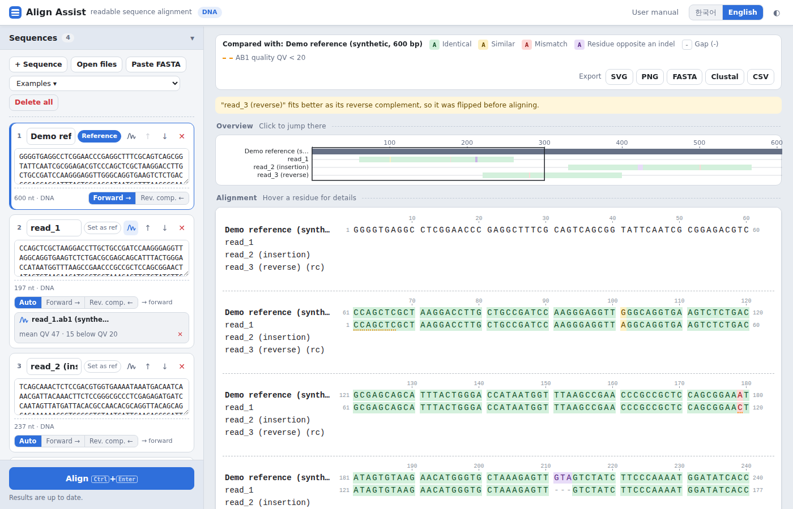
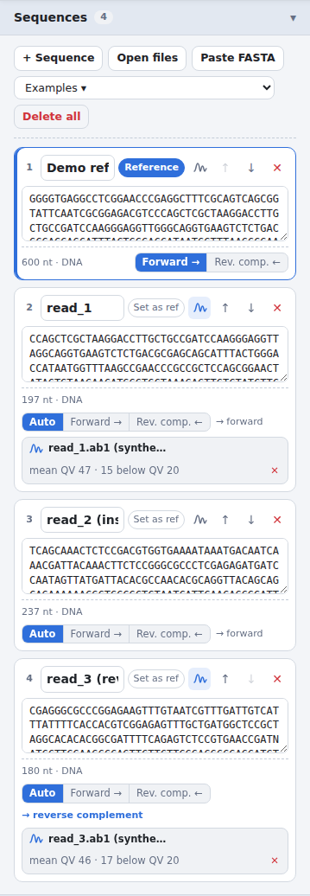
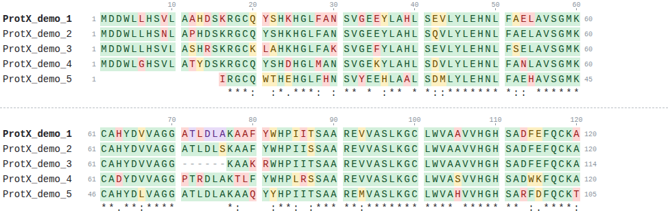
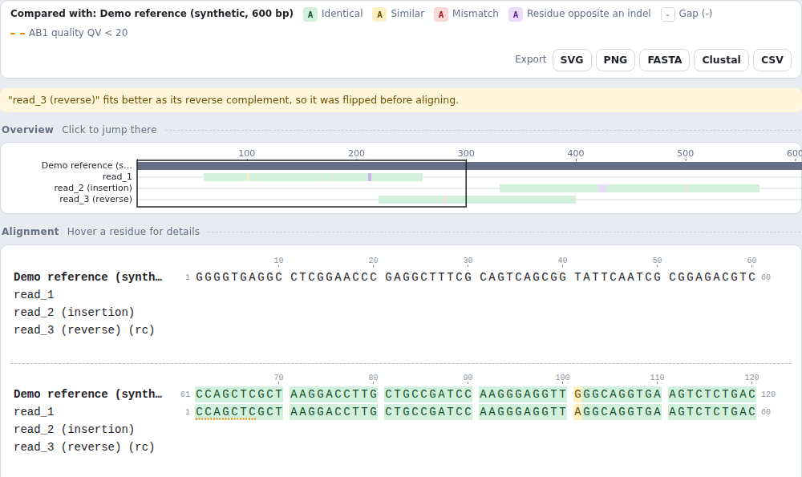
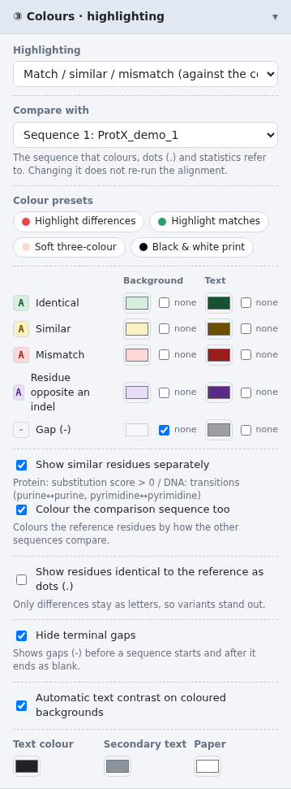
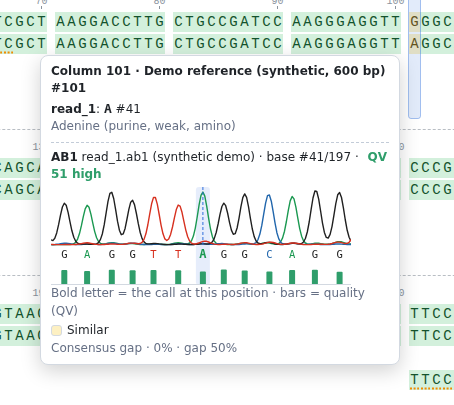
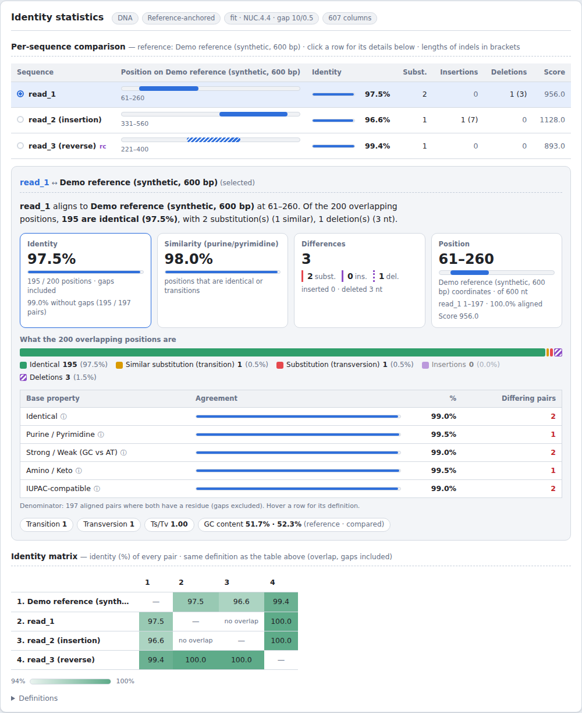

# Align Assist user manual

[한국어](manual.ko.md) · Web app: <https://rundope.github.io/Allign-assist/>

Align Assist shows DNA, RNA and protein sequence alignments in a **readable** way. Colours
show where and how well a sequence matches a reference and where several sequences agree
or differ, and agreement is also measured by residue properties. Attach Sanger sequencing
results (AB1) to see the signal and quality behind every base.

---

## Contents

1. [Getting started](#1-getting-started)
2. [The screen](#2-the-screen)
3. [Adding sequences](#3-adding-sequences)
4. [Choosing how to align](#4-choosing-how-to-align)
5. [Reading the alignment view](#5-reading-the-alignment-view)
6. [Layout, fonts and colours](#6-layout-fonts-and-colours)
7. [AB1 chromatograms](#7-ab1-chromatograms)
8. [Identity statistics](#8-identity-statistics)
9. [Export](#9-export)
10. [Language, theme and storage](#10-language-theme-and-storage)
11. [Limitations and FAQ](#11-limitations-and-faq)

---

## 1. Getting started

- **On the web**: open <https://rundope.github.io/Allign-assist/>. Nothing to install.
- **Offline**: in the repository run `npm install && npm run build`. This produces a single
  file, `dist/index.html`, that opens by double-clicking, without an internet connection.
- **On first visit** an example (synthetic sequences) loads: three reads mapped onto a 600 bp
  reference, with AB1 chromatograms on read_1 and read_3. Replace the text in the sequence
  cards on the left to align your own sequences.

> Your sequences never leave the browser. All computation runs on your own computer.

## 2. The screen

*The screen on first visit. Sequence cards and settings on the left; legend, overview and alignment view on the right.*

| Where | What |
|---|---|
| Top bar | User manual link, language switch (한국어 / English), light / dark switch |
| Left sidebar | **Sequences** cards → **① Alignment** → **② Layout · font** → **③ Colours · highlighting** → **④ Display**, and the **Align** button at the bottom |
| Top right | Legend (what the colours mean) and the **Export** buttons |
| Overview | The whole alignment, one thin line per sequence. Click to jump there. |
| Alignment | The wrapped sequences. Hover a residue for details. |
| Identity statistics | Summary sentence, key figures, property-based agreement, per-sequence comparison, identity matrix |

On narrow screens (phones) the sidebar moves above the results; the ☰ button hides it.

## 3. Adding sequences

### Getting sequences in

- **+ Sequence** adds an empty card. Paste into it; spaces and numbers are removed.
- **Open files** reads FASTA, GenBank (`ORIGIN` section), EMBL, plain text and **AB1** files, several at once.
- **Paste FASTA** takes a multi-record FASTA in one go.
- **Drag and drop** files or text onto the sequence area.
- **Examples ▾** loads one of three examples (reads + AB1, two DNA variants, five-protein MSA). All are synthetic.

Pasting a multi-record FASTA into a single card splits it into one card per record.

### What a card can do

*Sequence cards. read_1 and read_3 have AB1 files attached, and each card shows the strand that was chosen automatically.*

| Control | Purpose |
|---|---|
| Name field | Renames the sequence; the name is used in the alignment view and statistics. |
| **Set as ref / Reference** | Picks the reference for reference-anchored alignment. The reference card has a blue edge. |
| Waveform icon | Attaches an AB1 chromatogram (DNA only, see [section 7](#7-ab1-chromatograms)). |
| ↑ ↓ | Reorders. |
| ✕ | Deletes the card. |
| **Auto / Forward → / Rev. comp. ←** | Chooses which strand of a DNA / RNA sequence is aligned. |

**Strand choice**

- **Auto** picks whichever of forward or reverse complement fits the reference better. After
  a run the card shows `→ forward` or `→ reverse complement`, and reverse-complemented rows
  are marked `(rc)`.
- **Forward / Rev. comp.** force that strand.
- The reference (the first sequence for MSA) is the anchor, so it only offers forward or reverse complement.

**Delete all** needs two clicks, to prevent accidents.

## 4. Choosing how to align

### Method

| Method | Use it for |
|---|---|
| **Reference-anchored** (**Pairwise** with two sequences) | Aligns every sequence to one reference and merges them in reference coordinates. "Where does my sequence sit on the reference?", mapping several sequencing reads onto a plasmid. |
| **Multiple alignment (progressive MSA)** | Comparing many similar sequences at once. Merged in guide-tree (UPGMA) order. |

*A progressive MSA (the 'Protein: MSA of five sequences' example). The bottom line holds the conservation marks.*

### Mode

| Mode | Behaviour | Good for |
|---|---|---|
| **Fit** | Finds where the **whole** query fits inside the reference; the reference ends are free. | Mapping primers, reads or fragments onto a plasmid or gene |
| **Semi-global** | Overhangs at both ends are free. | Two similar sequences of different length |
| **Global** | End-to-end alignment (Needleman-Wunsch). | Sequences covering the same range |
| **Local** | Only the best-matching region (Smith-Waterman). | Domains and motifs |

MSA supports global and semi-global only; Fit and Local run as semi-global there.

### Scoring

- **Sequence type**: detected (DNA / RNA / protein) or set by hand. U and T count as the same base.
- **Protein matrix**: BLOSUM62 (default), BLOSUM45 or PAM250 (distant), BLOSUM80 (close).
- **DNA scoring**: NUC.4.4 / EDNAFULL (+5 / −4, IUPAC ambiguity codes) or your own match / mismatch.
- **Gap open / extend**: a gap of length L costs open + (L−1) × extend. The default 10 / 0.5 matches EMBOSS needle and water.
- **Search both strands**: applies to sequences whose strand is "Auto".

Small inputs re-align automatically when sequences or settings change. For large ones press **Align** (Ctrl+Enter).

## 5. Reading the alignment view

*Legend, overview (the black box is the part on screen) and alignment view. The orange dotted underline on read_1 marks low-quality bases.*

### Colours (highlighting = match / similar / mismatch)

Each residue is compared with the comparison target (default: the reference) and coloured in
one of five categories. Change the colours under **③ Colours · highlighting**.

| Category | Meaning |
|---|---|
| Identical | Same residue as the target |
| Similar | Protein: substitution score > 0 / DNA: transition (A↔G, C↔T) |
| Mismatch | Any other substitution |
| Residue opposite an indel | A residue where the other sequence has a gap |
| Gap (-) | A gap inside the sequence |

Gaps before a sequence starts or after it ends (terminal gaps) are shown blank by default.

### Other marks

- **Numbers left and right** are the first and last residue of the line. Reverse-complemented rows count down.
- **Ruler**: residue numbers of the comparison sequence by default, or alignment columns.
- **Conservation symbols**: `*` all identical, `:` substitution within a Clustal strong group, `.` within a weak group.
- **Consensus row** and **per-column % identity bars**: switch on under ④ Display.
- **Dots (.)**: residues identical to the reference become dots, so only differences remain as letters.
- **Orange dotted underline**: AB1 quality below the threshold ([section 7](#7-ab1-chromatograms)).

### Tooltip

Hovering a residue shows the column, the position on the reference, the residue and its
number, its name and properties (Lehninger class and Kyte-Doolittle value for proteins), its
comparison category, and the column consensus. Rows with an AB1 file also show the chromatogram.

## 6. Layout, fonts and colours

**② Layout · font**

| Setting | Effect |
|---|---|
| Residues per line | 0 fits the window width. |
| Column spacing | Space between residues (px). Above 0 every residue gets a separate colour tile. |
| Row spacing | Space between sequence rows (px). |
| Block spacing / dashed line between blocks | Space and a dashed rule between wrapped blocks. The rule is also exported. |
| Group size / gap | Extra space every N residues (e.g. 10). 0 turns grouping off. |
| Font, size, weight | Residues stay on the column grid with any font. "Custom…" accepts any installed font name. |

**③ Colours · highlighting**

*The ③ Colours · highlighting panel. Each category has its own background and text colour.*

- **Highlighting**: match / similar / mismatch, column conservation shading (Jalview Percentage
  Identity style), residue property colours (ClustalX, Zappo, Taylor, Hydrophobicity, Lehninger,
  Nucleotide), or none.
- **Compare with**: any sequence or the consensus. Changing it does not re-run the alignment;
  the statistics follow it.
- **Colour presets**: highlight differences, highlight matches, soft three-colour, black & white
  print. Background and text colours can also be set per category.
- **Text, secondary text and paper colours** set the alignment view and exported images.

**④ Display**: names, numbers, ruler, conservation symbols, consensus, AB1 quality underline and
its QV threshold, % identity bars, range shown (everything / only where two or more sequences
overlap), and a reset button.

## 7. AB1 chromatograms

Attach the Sanger result file (`.ab1`, ABIF format) and every aligned base shows the signal it
came from and how reliable it is.

### Attaching

- **Waveform icon on a card** attaches an AB1 file to that sequence. If the card is empty, the
  AB1 base calls become the sequence.
- **Open files / drag and drop** an `.ab1` file adds its base calls as a new card with the
  chromatogram attached, named after the sample stored in the file.

The card then shows `file name · mean QV · number below QV 20`. ✕ detaches it.

### Matching the sequence to the file

The card's sequence need not be identical to the AB1 base calls. Trimmed, hand-edited or
reverse-complemented copies are aligned to the calls, so each residue finds its peak. If less
than 80% matches, the card warns in red: the file may belong to another sample.

### The chromatogram in the tooltip

*Hovering base 41 of read_1: four-channel traces, base calls, quality bars and the QV.*

Hovering a residue of a sequence with an AB1 file shows:

- the **four-channel trace** around that base (six bases either side; A green, C blue, G black, T red),
- the **base calls**, with the current one in bold and marked by a dashed line,
- **quality bars** and the **QV**: 30 and above high, 20–29 medium, below 20 low.
- For reverse-complemented rows the picture is mirrored and each channel drawn as its
  complementary base, so it reads in the same direction as the row.

QV is the Phred quality value: QV 20 means a 1% chance the call is wrong, QV 30 means 0.1%.

### Quality underline

Bases whose QV is below the threshold (default 20) get an orange dotted underline. A mismatch
on a clean, high-quality peak is likely a real difference; one on a weak, mixed peak may be a
sequencing error. Change the threshold under **④ Display**.

> Attached AB1 files are kept per sequence in browser storage and survive a reload. If storage
> is full you are told, and the file has to be added again after a reload.

## 8. Identity statistics

*Per-sequence comparison, details of the selected sequence (read_1), and the identity matrix.*

With **three or more sequences** a **per-sequence comparison** table comes first: a mini map
of where each sequence lies on the reference, its identity, and substitution / insertion /
deletion counts. Click a row to see its details below.

**Details of the selected sequence**

1. **Summary sentence**, e.g. "read_1 aligns to Demo reference at 61–260. Of the 200 overlapping positions, 195 are identical (97.5%), with 2 substitution(s), 1 deletion(s) (3 nt)."
2. **Cards**: identity (with its denominator and the value without gaps), similarity, differences (substitutions, insertions, deletions), position.
3. **Composition bar**: how many overlap positions are identical / similar substitutions / substitutions / insertions / deletions.
4. **Property table**: for proteins identical, Clustal strong group, physicochemical class
   (Lehninger), charge, hydropathy (Kyte-Doolittle); for DNA identical, purine / pyrimidine,
   strong / weak, amino / keto, IUPAC-compatible. The "Differing pairs" column shows how much each property changed.
5. **Substitution types**: for DNA transitions, transversions, Ts/Tv and GC content; for proteins the mean |ΔHydropathy|.

**Identity matrix**: identity of every pair; pairs that do not overlap say "no overlap".

**Definitions**

- **Overlap**: from the first to the last position where both sequences have a residue. End overhangs are left out; internal gaps are included.
- **Identity** = identical residues / overlap positions.
- **Similarity** = identical or similar positions / overlap positions (protein: substitution score > 0; DNA: transitions).
- **Insertions and deletions** are relative to the reference: insertion = residues only in the compared sequence, deletion = residues only in the reference.

## 9. Export

| Format | Contents |
|---|---|
| **SVG** | Vector image; stays sharp in papers and slides. |
| **PNG** | Image at 2× resolution. Beyond the browser's size limit the resolution drops, or SVG is suggested. |
| **FASTA** | Aligned FASTA with gaps; reverse-complemented rows are marked in the name. |
| **Clustal** | Clustal `.aln`, with the conservation line. |
| **CSV** | Per-sequence statistics (three identity measures, similarity, substitutions, insertions, deletions, ranges, score, property agreement). Opens directly in Excel. |

## 10. Language, theme and storage

- **Language**: `한국어 / English` in the top bar. The first visit follows the browser language.
- **Theme**: ◐ switches light / dark. The alignment's paper colour follows its own setting.
- **Storage**: sequences, settings, language and AB1 files are stored only in this browser. They are not shared with other computers or browsers.

## 11. Limitations and FAQ

**Limitations**

- One pairwise alignment is limited to about 150 million cells (e.g. 10 kb × 15 kb). Genome-scale sequences are not supported yet.
- Progressive MSA does no iterative refinement. For distant or many sequences it can be less accurate than Clustal Omega or MAFFT.
- Only AB1 (ABIF) chromatograms are read; SCF, ZTR and others are not.

**FAQ**

- **I still see the old version after an update.** Hard-reload the page (Ctrl+Shift+R, or Cmd+Shift+R on a Mac).
- **The example does not load automatically.** Sequences from an earlier visit open instead. Choose it from `Examples ▾`.
- **A read aligned the wrong way round.** Set its strand to "Forward" or "Rev. comp." on the card.
- **Why are there two identity values?** The large number counts the overlap including gaps; "without gaps" counts only pairs where both sequences have a residue.

---

License: MIT (`LICENSE`). For third-party material see `THIRD_PARTY_NOTICES.md`.
