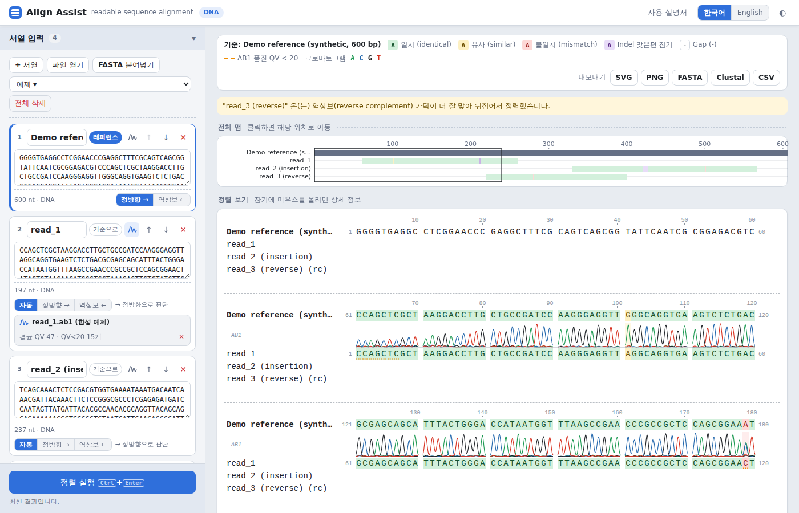
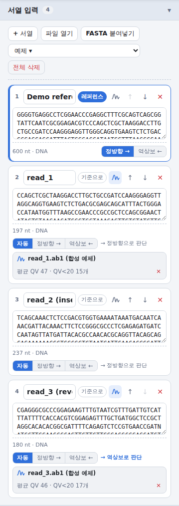
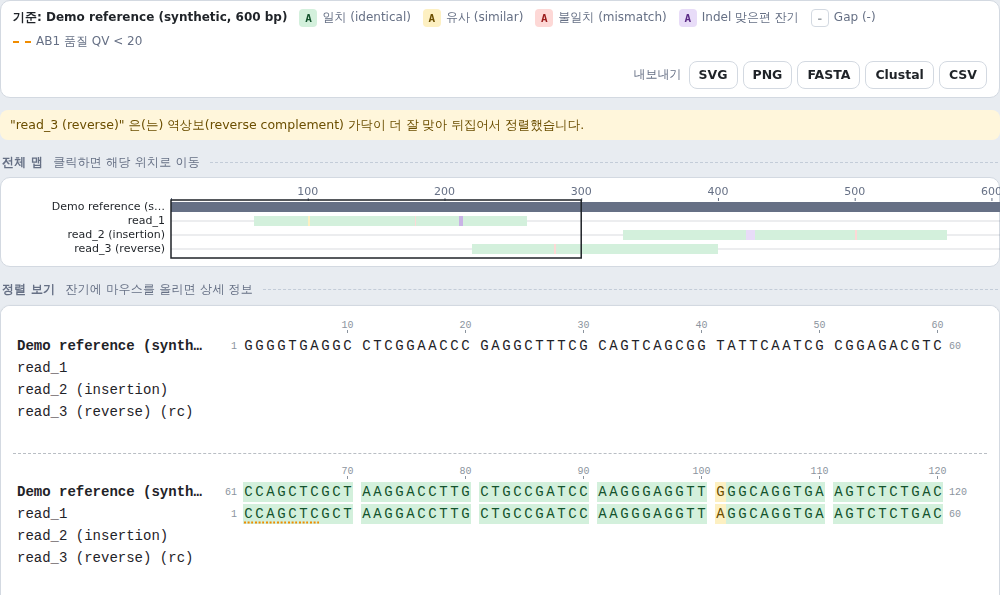
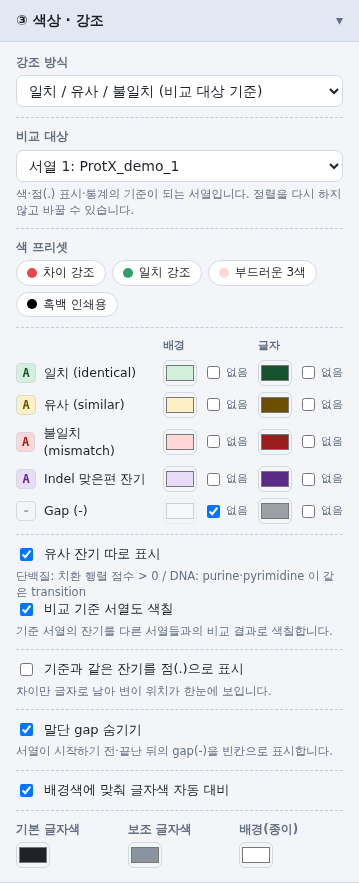
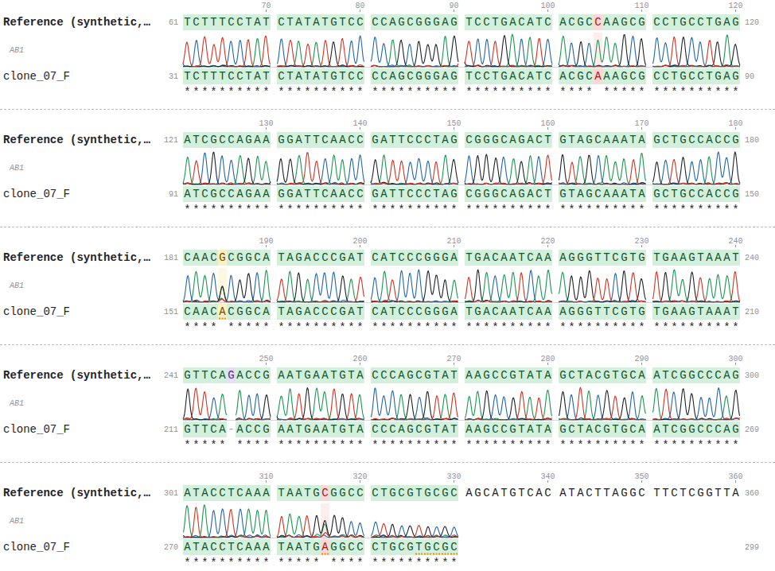
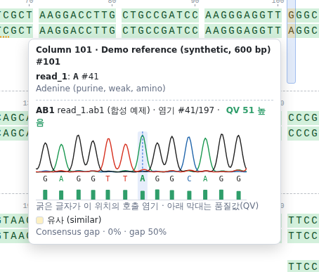
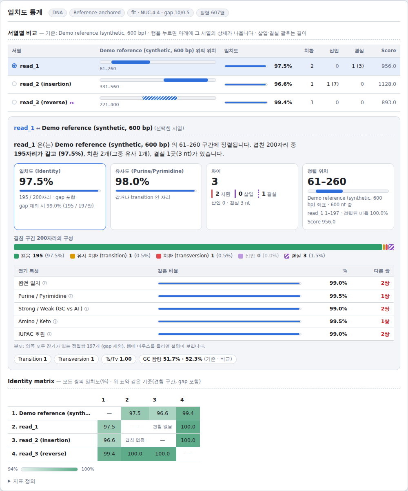

  <picture>
    <source media="(prefers-color-scheme: dark)" srcset="images/spoonbills-dark.png">
    
  </picture>

# Allign-assist 사용 설명서

[English](manual.en.md) · 웹 앱: <https://rundope.github.io/Allign-assist/>

Allign-assist 는 DNA·RNA·단백질 서열 정렬을 **읽기 쉽게** 보여주는 웹 앱입니다. 한 서열이
레퍼런스의 어디에, 얼마나 맞는지와 여러 서열이 어디가 같고 어디가 다른지를 색으로 보여주고,
일치도를 잔기 물성 기준으로도 계산합니다. Sanger 시퀀싱 결과(AB1)를 붙이면 각 염기의 신호와
품질값도 같이 볼 수 있습니다.

---

## 목차

1. [시작하기](#1-시작하기)
2. [화면 구성](#2-화면-구성)
3. [서열 입력](#3-서열-입력)
4. [정렬 방법 고르기](#4-정렬-방법-고르기)
5. [정렬 보기 읽는 법](#5-정렬-보기-읽는-법)
6. [레이아웃·글꼴·색상](#6-레이아웃글꼴색상)
7. [AB1 크로마토그램](#7-ab1-크로마토그램)
8. [일치도 통계](#8-일치도-통계)
9. [내보내기](#9-내보내기)
10. [언어·테마·저장](#10-언어테마저장)
11. [제한 사항과 자주 묻는 질문](#11-제한-사항과-자주-묻는-질문)

---

## 1. 시작하기

- **웹에서 쓰기**: <https://rundope.github.io/Allign-assist/> 를 엽니다. 설치가 필요 없습니다.
- **오프라인으로 쓰기**: 저장소에서 `npm install && npm run build` 를 실행하면 `dist/index.html`
  한 파일이 만들어집니다. 이 파일은 인터넷 없이 더블클릭만으로 열립니다.
- **처음 열면** 예제(합성 서열)가 자동으로 뜹니다. 600 bp 레퍼런스에 read 3개를 매핑한 예제이고,
  read_1·read_3 에는 AB1 크로마토그램이 붙어 있어 정렬 줄 바로 위에 그려집니다. 왼쪽 서열 카드의
  내용을 바꾸면 내 서열로 정렬됩니다. AB1 파일로 시작하려면 **파일 열기**로 올리면 됩니다
  ('DNA: AB1 read 와 레퍼런스 비교' 예제 참고).

> 입력한 서열은 브라우저 밖으로 전송되지 않습니다. 정렬 계산은 모두 사용자 컴퓨터에서 이루어집니다.

## 2. 화면 구성

*처음 열었을 때의 화면. 왼쪽은 서열 카드와 설정, 오른쪽은 범례·전체 맵·정렬 보기입니다.*

| 위치 | 내용 |
|---|---|
| 상단바 | 사용 설명서 링크, 언어 전환(한국어 / English), 라이트·다크 전환 |
| 왼쪽 사이드바 | **서열 입력** 카드 → **① 정렬 방법** → **② 레이아웃 · 글꼴** → **③ 색상 · 강조** → **④ 표시 요소**, 맨 아래 **정렬 실행** 버튼 |
| 오른쪽 위 | 범례(색의 뜻)와 **내보내기** 버튼 |
| 전체 맵 | 정렬 전체를 한 줄씩 줄여 보여줍니다. 클릭하면 그 위치로 이동합니다. |
| 정렬 보기 | 서열을 줄바꿈해서 보여줍니다. 잔기에 마우스를 올리면 상세 정보가 뜹니다. |
| 일치도 통계 | 요약 문장, 핵심 수치, 물성 기준 일치도, 서열별 비교, identity matrix |

화면이 좁으면(휴대폰) 사이드바가 위로 올라가고, 상단바의 ☰ 버튼으로 접을 수 있습니다.

## 3. 서열 입력

### 서열 넣기

- **+ 서열**: 빈 카드를 추가합니다. 카드에 서열을 붙여넣으면 공백·숫자는 자동으로 지워집니다.
- **파일 열기**: FASTA, GenBank(`ORIGIN` 부분), EMBL, 일반 텍스트, **AB1** 파일을 여러 개 한꺼번에 열 수 있습니다.
- **FASTA 붙여넣기**: 여러 레코드가 든 FASTA 를 한 번에 붙여넣습니다.
- **끌어놓기**: 파일이나 텍스트를 서열 입력 영역에 끌어다 놓아도 됩니다.
- **예제 ▾**: 예제 4종(read 매핑 + AB1, AB1 read 와 레퍼런스 비교, 두 DNA 변이체 비교, 단백질 5개 MSA)을 불러옵니다. 모두 합성 데이터입니다.

AB1 파일도 서열 입력으로 바로 쓸 수 있습니다. **파일 열기**나 끌어놓기로 `.ab1` 을 올리면 염기 호출이 새 서열 카드가 되고,
크로마토그램이 그 카드에 붙습니다([7장](#7-ab1-크로마토그램)).

카드 하나에 여러 레코드의 FASTA 를 붙여넣으면 레코드마다 카드가 나뉩니다.

### 카드에서 할 수 있는 것

*서열 카드. read_1·read_3 에는 AB1 이 붙어 있고, 가닥은 자동 판단 결과가 표시됩니다.*

| 버튼 | 기능 |
|---|---|
| 이름 칸 | 서열 이름을 바꿉니다. 정렬 보기와 통계에 이 이름이 쓰입니다. |
| **기준으로 / 레퍼런스** | 레퍼런스 기준 정렬에서 기준 서열을 고릅니다. 레퍼런스 카드는 파란 테두리로 표시됩니다. |
| 파형 아이콘 | AB1 크로마토그램을 붙입니다(DNA 만, [7장](#7-ab1-크로마토그램)). |
| ↑ ↓ | 순서를 바꿉니다. |
| ✕ | 카드를 지웁니다. |
| **자동 / 정방향 → / 역상보 ←** | DNA·RNA 서열을 어느 가닥으로 정렬할지 정합니다. |

**가닥 선택**

- **자동**: 정방향과 역상보(reverse complement) 중 레퍼런스에 더 잘 맞는 쪽을 고릅니다. 정렬이
  끝나면 카드에 `→ 정방향으로 판단` 또는 `→ 역상보로 판단` 이 표시되고, 역상보로 정렬된 서열은
  이름 뒤에 `(rc)` 가 붙습니다.
- **정방향 / 역상보**: 자동 판단 없이 그 방향으로만 정렬합니다.
- 레퍼런스(MSA 에서는 첫 서열)는 기준이므로 정방향·역상보만 고를 수 있습니다.

**전체 삭제**는 실수를 막기 위해 두 번 눌러야 실행됩니다.

## 4. 정렬 방법 고르기

### 방식

| 방식 | 언제 쓰나 |
|---|---|
| **레퍼런스 기준 정렬** (서열이 2개면 **쌍 정렬**) | 레퍼런스 하나에 나머지를 각각 정렬해 레퍼런스 좌표로 합칩니다. "내 서열이 레퍼런스 어디에 붙는가", 플라스미드에 sequencing read 여러 개 매핑 |
| **다중 서열 정렬 (Progressive MSA)** | 서로 비슷한 여러 서열을 한꺼번에 비교. Guide tree(UPGMA) 순서로 합칩니다. |

*Progressive MSA 예시('단백질: 5개 서열 MSA' 예제). 맨 아래 줄은 보존 기호입니다.*

### 정렬 모드

| 모드 | 동작 | 알맞은 경우 |
|---|---|---|
| **Fit** | 레퍼런스 안에서 비교 서열 **전체**가 들어갈 자리를 찾습니다. 레퍼런스 양 끝은 벌점이 없습니다. | primer·read·조각을 플라스미드/유전자에 매핑 |
| **Semi-global** | 양쪽 말단 overhang 에 벌점이 없습니다. | 길이가 다른 비슷한 두 서열 |
| **Global** | 처음부터 끝까지 정렬합니다(Needleman-Wunsch). | 같은 범위를 덮는 서열 |
| **Local** | 가장 잘 맞는 부분 구간만 찾습니다(Smith-Waterman). | 도메인·모티프 찾기 |

MSA 는 Global·Semi-global 만 지원하므로 Fit·Local 을 고르면 Semi-global 로 실행됩니다.

### 점수

- **서열 종류**: 자동 감지(DNA/RNA/Protein) 또는 직접 지정. U 와 T 는 같은 염기로 취급합니다.
- **단백질 치환 행렬**: BLOSUM62(기본), BLOSUM45·PAM250(먼 관계), BLOSUM80(가까운 관계).
- **DNA 점수**: NUC.4.4 / EDNAFULL(+5 / −4, IUPAC 모호 코드 지원) 또는 match·mismatch 직접 지정.
- **Gap open / extend**: 길이 L 인 gap 의 비용 = open + (L−1) × extend. 기본값 10 / 0.5 는 EMBOSS needle·water 와 같습니다.
- **양쪽 가닥 탐색**: 가닥이 '자동'인 서열에만 적용됩니다.

입력이 작으면 서열이나 설정을 바꾸는 즉시 자동으로 다시 정렬합니다. 크면 **정렬 실행**(Ctrl+Enter)을 누르세요.

## 5. 정렬 보기 읽는 법

*범례, 전체 맵(검은 사각형이 지금 보이는 범위), 정렬 보기. read_1 의 주황 점선은 품질이 낮은 염기입니다.*

### 색 (강조 방식 = 일치 / 유사 / 불일치)

비교 대상(기본: 레퍼런스)과 비교해 각 잔기를 다섯 범주로 칠합니다. 색은 **③ 색상 · 강조**에서 바꿀 수 있습니다.

| 범주 | 뜻 |
|---|---|
| 일치 (identical) | 비교 대상과 같은 잔기 |
| 유사 (similar) | 단백질: 치환 행렬 점수 > 0 / DNA: transition(A↔G, C↔T) |
| 불일치 (mismatch) | 그 외 치환 |
| Indel 맞은편 잔기 | 상대 서열이 gap 인 자리의 잔기 |
| Gap (-) | 서열 내부의 gap |

서열이 시작하기 전이나 끝난 뒤의 gap(말단 gap)은 기본적으로 빈칸으로 표시합니다.

### 그 밖의 표시

- **왼쪽·오른쪽 숫자**: 그 줄의 첫·마지막 잔기 번호입니다. 역상보로 정렬된 서열은 번호가 거꾸로 셉니다.
- **눈금자**: 기본은 비교 기준 서열의 잔기 번호, 설정에서 정렬 열 번호로 바꿀 수 있습니다.
- **보존 기호**: `*` 모든 서열 동일, `:` Clustal strong group 안의 치환, `.` weak group 안의 치환.
- **Consensus 행**, **열별 % identity 막대**: ④ 표시 요소에서 켭니다.
- **점(.) 표시**: 기준과 같은 잔기를 점으로 바꿔 차이만 글자로 남깁니다.
- **주황 점선 밑줄**: AB1 품질값이 기준보다 낮은 염기([7장](#7-ab1-크로마토그램)).
- **서열 위의 신호 곡선(AB1)**: AB1 이 붙은 서열은 정렬 줄 바로 위에 크로마토그램이 그려집니다([7장](#7-ab1-크로마토그램)).

### 툴팁

잔기에 마우스를 올리면 열 번호, 기준 서열의 위치, 그 서열의 잔기와 번호, 잔기 이름과 성질
(단백질은 Lehninger 계열과 Kyte-Doolittle 값), 비교 범주, 그 열의 consensus 와 비율이 나옵니다.
AB1 이 붙은 서열이면 크로마토그램도 나옵니다.

## 6. 레이아웃·글꼴·색상

**② 레이아웃 · 글꼴**

| 설정 | 설명 |
|---|---|
| 한 줄에 표시할 잔기 수 | 0 이면 창 너비에 맞춥니다. |
| 세로줄 간격 | 잔기 사이 간격(px). 0 보다 크면 색 타일이 잔기마다 분리됩니다. |
| 가로줄 간격 | 서열 행 사이 간격(px). |
| 블록 간격 / 블록 사이 점선 | 줄바꿈된 블록 사이 간격과 구분 점선. 점선은 이미지 내보내기에도 들어갑니다. |
| 묶음 단위 / 간격 | 10 잔기마다 띄우는 식의 묶음. 0 이면 묶지 않습니다. |
| 글꼴·크기·굵기 | 어떤 글꼴이든 잔기는 열 격자에 정확히 맞춰 배치됩니다. '직접 입력…'으로 설치된 글꼴 이름을 쓸 수 있습니다. |

**③ 색상 · 강조**

*③ 색상 · 강조 패널. 범주마다 배경색과 글자색을 따로 고릅니다.*

- **강조 방식**: 일치/유사/불일치, 열 보존도 음영(Jalview Percentage Identity 방식), 잔기 물성 색
  (ClustalX, Zappo, Taylor, Hydrophobicity, Lehninger, Nucleotide), 색 없음.
- **비교 대상**: 아무 서열이나 consensus. 정렬을 다시 하지 않고 바꿀 수 있고, 통계도 이 대상을 기준으로 다시 계산됩니다.
- **색 프리셋**: 차이 강조, 일치 강조, 부드러운 3색, 흑백 인쇄용. 범주별 배경·글자색을 따로 고를 수도 있습니다.
- **기본 글자색·보조 글자색·배경(종이)**: 정렬 보기와 이미지 내보내기의 바탕색입니다.

**④ 표시 요소**: 이름, 번호, 눈금자, 보존 기호, consensus, AB1 크로마토그램 표시와 높이, AB1 품질 밑줄과 기준 QV, % identity 막대,
표시 범위(전체 / 두 서열 이상 겹치는 구간만), 표시 설정 초기화.

## 7. AB1 크로마토그램

Sanger 시퀀싱 결과 파일(`.ab1`, ABIF 형식)을 붙이면, 정렬된 각 염기가 실제로 어떤 신호에서
나왔는지와 얼마나 믿을 만한지를 같이 볼 수 있습니다.

### 붙이는 방법

- **카드의 파형 아이콘**: 그 서열에 AB1 을 붙입니다. 카드가 비어 있으면 AB1 의 염기 호출이 서열이 됩니다.
- **파일 열기 / 끌어놓기**: `.ab1` 파일을 올리면 염기 호출이 새 서열 카드로 추가되고 AB1 이 붙습니다.
  이름은 AB1 에 기록된 샘플명을 씁니다.

붙이면 카드 아래에 `파일명 · 평균 QV · QV<20 개수` 가 표시됩니다. ✕ 로 연결을 해제합니다.

### 서열과 AB1 맞추기

카드의 서열이 AB1 의 염기 호출과 똑같지 않아도 됩니다. 앞뒤를 잘라낸 서열, 손으로 고친 서열,
역상보로 넣은 서열도 염기 호출과 정렬해서 각 잔기에 맞는 peak 을 찾습니다. 서로 80% 미만으로만
맞으면 다른 샘플의 파일일 수 있어 카드에 빨간 경고가 뜹니다.

### 정렬 줄 위의 크로마토그램

*'DNA: AB1 read 와 레퍼런스 비교' 예제. 105번은 깨끗한 단일 peak(실제 차이), 185번은 두 peak 이 겹친 자리(이형접합 등),
246번은 read 에 없는 염기(결실)라 곡선이 비어 있습니다.
316번은 read 끝의 품질 낮은 peak 이라 시퀀싱 오류일 가능성이 큽니다.*

AB1 이 붙은 서열은 정렬 줄 바로 위에 4채널 신호 곡선이 그려집니다. 각 염기의 peak 은 바로 아래 글자와
같은 열에 오도록 늘이거나 줄여서 맞추므로, 정렬을 보면서 차이가 난 자리의 peak 을 바로 확인할 수 있습니다.

- 비교 대상과 다른 자리(불일치·유사·indel)는 곡선 뒤에 그 범주의 색 띠가 깔립니다.
- read 의 gap 자리와 손으로 입력한 염기 자리는 곡선이 비어 있습니다.
- 역상보로 정렬된 서열은 곡선을 좌우로 뒤집고 채널을 상보 염기 색으로 그려, 아래 글자와 같은 방향으로 읽힙니다.
- 높이는 블록마다 그 구간에서 가장 높은 peak 에 맞춥니다. 다만 read 전체 최고치의 20% 아래로는 키우지 않아, 신호가 약한 read 끝부분이 과장되지 않습니다.
- read 에 염기가 없는 블록에는 곡선 줄을 만들지 않습니다.
- **④ 표시 요소**에서 끄거나 높이를 바꿀 수 있습니다. SVG·PNG 내보내기에도 그대로 들어갑니다.

차이가 보이면 이렇게 판단할 수 있습니다. 높고 깨끗한 peak 하나면 실제 차이일 가능성이 큽니다.
비슷한 높이의 peak 두 개가 겹치면 이형접합이나 혼합 샘플을 의심합니다. peak 이 낮고 배경 잡음이 크면(보통 read 끝) 시퀀싱 오류일 수 있습니다.

### 툴팁의 크로마토그램

*read_1 의 41번째 염기에 마우스를 올린 모습. 4채널 신호, 호출 염기, 품질 막대와 QV 가 나옵니다.*

AB1 이 붙은 서열의 잔기에 마우스를 올리면 다음이 나옵니다.

- 그 염기 앞뒤 6 개 구간의 **4채널 신호 곡선** (A 초록, C 파랑, G 검정, T 빨강)
- **호출 염기**: 현재 위치는 굵은 글자와 세로 점선
- **품질 막대**와 **QV 값**: 30 이상 높음, 20–29 보통, 20 미만 낮음
- 역상보로 정렬된 서열이면 그림을 좌우로 뒤집고 채널을 상보 염기로 바꿔, 정렬 줄과 같은 방향으로 보여줍니다.

QV 는 Phred 품질값입니다. QV 20 은 오류 확률 1%, QV 30 은 0.1% 입니다.

### 품질 밑줄

QV 가 기준(기본 20)보다 낮은 염기 아래에 주황 점선이 그어집니다. 같은 "불일치"라도 품질이 높은
peak 이면 실제 차이일 가능성이 크고, 품질이 낮고 peak 이 겹쳐 있으면 시퀀싱 오류일 수 있습니다.
기준값은 **④ 표시 요소**에서 바꿉니다.

> 붙인 AB1 은 서열별로 브라우저 저장소에 보관되어 새로고침해도 남습니다. 저장 공간이 부족하면
> 알림이 뜨고, 그때는 새로고침 후 다시 올려야 합니다.

## 8. 일치도 통계

*서열별 비교 표, 선택한 서열(read_1)의 상세, identity matrix.*

**서열이 3개 이상**이면 먼저 **서열별 비교** 표가 나옵니다. 행마다 레퍼런스 위 위치(미니맵),
일치도, 치환·삽입·결실 수가 있고, 행을 누르면 아래에 그 서열의 상세가 나옵니다.

**선택한 서열의 상세**

1. **요약 문장**: 예) "read_1 은(는) Demo reference 의 61–260 구간에 정렬됩니다. 겹친 200자리 중 195자리가 같고 (97.5%), 치환 2개, 결실 1곳(3 nt)가 있습니다."
2. **카드**: 일치도(분모 명시, gap 제외 값 함께), 유사도, 차이(치환·삽입·결실), 정렬 위치.
3. **겹침 구간 구성 막대**: 같음 / 유사 치환 / 치환 / 삽입 / 결실 이 각각 몇 자리인지.
4. **물성 표**: 단백질은 완전 일치, Clustal strong group, 물리화학적 계열(Lehninger 5계열), 전하,
   소수성(Kyte-Doolittle), DNA 는 완전 일치, Purine/Pyrimidine, Strong/Weak, Amino/Keto, IUPAC 호환.
   각 행의 "다른 쌍" 수로 어느 성질이 얼마나 바뀌었는지 봅니다.
5. **치환 유형**: DNA 는 Transition·Transversion 수와 Ts/Tv, GC 함량. 단백질은 평균 |ΔHydropathy|.

**Identity matrix**: 모든 쌍의 일치도. 겹치지 않는 쌍은 "겹침 없음"으로 표시됩니다.

**지표 정의**

- **겹침 구간**: 두 서열이 모두 잔기를 가진 첫 자리부터 마지막 자리까지. 말단 overhang 은 빼고 내부 gap 은 넣습니다.
- **일치도** = 같은 잔기 수 / 겹침 구간 자리 수.
- **유사도** = (같거나 유사한 자리) / 겹침 구간 자리 수. 단백질은 치환 행렬 점수 > 0, DNA 는 transition 을 유사로 봅니다.
- **삽입·결실**은 기준 서열에 대한 방향입니다. 삽입 = 비교 서열에만 있는 잔기, 결실 = 기준 서열에만 있는 잔기.

## 9. 내보내기

| 형식 | 내용 |
|---|---|
| **SVG** | 벡터 이미지. 논문·슬라이드용으로 확대해도 깨지지 않습니다. |
| **PNG** | 2배 해상도 이미지. 브라우저 크기 제한을 넘으면 해상도를 낮추거나 SVG 를 권합니다. |
| **FASTA** | gap 이 들어간 정렬 FASTA. 역상보 서열은 이름에 표시됩니다. |
| **Clustal** | Clustal `.aln` 형식(보존 기호 줄 포함). |
| **CSV** | 서열별 통계(일치도 3종, 유사도, 치환·삽입·결실, 구간, 점수, 물성 일치도). Excel 에서 바로 열립니다. |

## 10. 언어·테마·저장

- **언어**: 상단바의 `한국어 / English` 로 전환합니다. 처음에는 브라우저 언어를 따릅니다.
- **테마**: ◐ 버튼으로 라이트·다크를 바꿉니다. 정렬 보기의 바탕(종이)색은 설정값을 따릅니다.
- **저장**: 서열, 설정, 언어, AB1 은 브라우저에만 저장됩니다. 다른 컴퓨터나 브라우저와는 공유되지 않습니다.

## 11. 제한 사항과 자주 묻는 질문

**제한 사항**

- 한 번의 쌍 정렬은 최대 약 1.5억 셀(예: 10 kb × 15 kb)까지 계산합니다. 게놈 규모 서열은 아직 지원하지 않습니다.
- Progressive MSA 는 반복 정제를 하지 않습니다. 먼 관계이거나 서열이 많으면 Clustal Omega·MAFFT 보다 정확도가 낮을 수 있습니다.
- AB1(ABIF) 형식만 읽습니다. SCF·ZTR 등은 지원하지 않습니다.

**자주 묻는 질문**

- **업데이트 후에도 예전 화면이 보여요.** 강력 새로고침(Ctrl+Shift+R, Mac 은 Cmd+Shift+R)을 하세요.
- **예제가 자동으로 안 떠요.** 이전에 쓴 서열이 저장돼 있으면 그 서열이 열립니다. `예제 ▾` 에서 고르세요.
- **read 가 거꾸로 붙었어요.** 카드의 가닥을 '정방향' 또는 '역상보'로 직접 지정하세요.
- **일치도가 두 가지로 보여요.** 카드의 큰 숫자는 겹침 구간(gap 포함) 기준이고, 아래 "gap 제외" 는 양쪽 모두 잔기가 있는 쌍만 셉니다.

---

라이선스: MIT (`LICENSE`). 포함된 외부 자료는 `THIRD_PARTY_NOTICES.md` 를 보세요.
